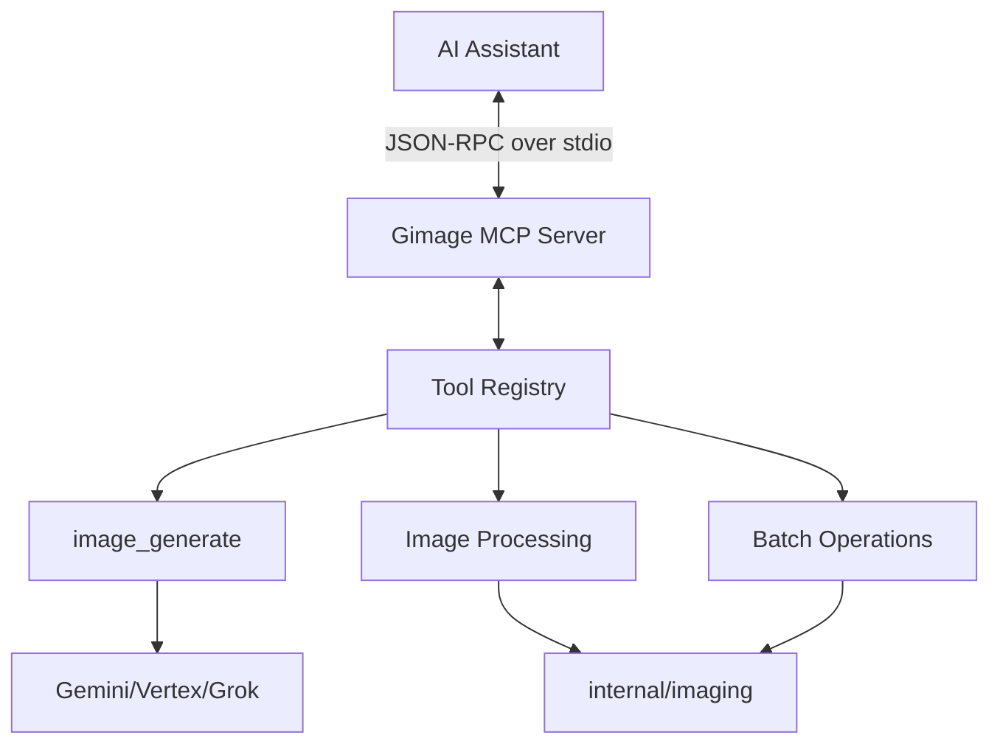

# Gimage MCP Server

**Version**: see [CHANGELOG.md](CHANGELOG.md) / latest GitHub release
**Runtime**: Go 1.26+
**Protocol**: Model Context Protocol (stdio transport)

---

##  Overview

The Gimage MCP server enables AI assistants (like Claude and ChatGPT) to perform AI-powered image generation and processing operations directly through the Model Context Protocol.

### Key Features

- **Direct CLI Integration**: Reuses the core gimage internal packages for identical behavior across CLI and MCP.
- **Provider Multi-plexing**: Single tool to access Gemini, Vertex AI, and xAI Grok.
- **Native Go Implementation**: Fast, single-binary deployment with no Node.js dependency.
- **LLM Optimized**: Clear tool descriptions, comprehensive schemas, and helpful error messages.

---

##  Architecture

The MCP server uses **stdio transport** for communication, making it compatible with Claude Desktop and other MCP-aware clients.



- **Input/Output**: JSON-RPC 2.0 messages via stdin/stdout.
- **Logging**: All internal logs are directed to stderr to avoid protocol interference.
- **Configuration**: Respects existing `~/.gimage/config.md` and environment variables.

---

##  MCP Tools

The server exposes 10 tools covering all gimage operations. For a complete parameter reference, see [docs/MCP_TOOLS.md](docs/MCP_TOOLS.md).

### 1. Image Generation

- `generate_image`: Generate AI images from text prompts. Supports `input_images` for reference-image editing (Grok 2.0 max 5 via `/images/edits`; Gemini Nano Banana compositional editing - up to 3/11/14 depending on model). Gemini 3+ also supports `thinking` (reasoning depth: `minimal|low|medium|high`) and `grounding` (Google Search grounding for current/real references; not Flash Lite). Grok 2.0 accepts `quality` (`low|medium|auto`).
- `list_models`: List available providers, models, and pricing.

### 2. Single Image Processing

- `resize_image`: Change dimensions (WxH).
- `scale_image`: Scale by factor (0.1 to 10.0).
- `crop_image`: Extract a rectangular region.
- `compress_image`: Reduce file size (1-100 quality).
- `convert_image`: Change format (PNG, JPG, WebP, etc.).

### 3. Batch Operations

- `batch_resize`: Concurrently resize a directory of images.
- `batch_compress`: Concurrently compress a directory of images.
- `batch_convert`: Concurrently convert a directory of images.

---

##  Installation & Setup

For detailed installation instructions for Claude Desktop, see [README.md#installation-methods](README.md#installation-methods) or [docs/MCP_USAGE.md](docs/MCP_USAGE.md).

### Quick Start (Homebrew)

```bash
brew install apresai/tap/gimage
gimage auth setup gemini
```

Then add to your Claude Desktop config:

```json
{
 "mcpServers": {
 "gimage": {
 "command": "gimage",
 "args": ["serve"]
 }
 }
}
```

---

##  Documentation Links

- [**Usage Guide**](docs/MCP_USAGE.md): Complete setup and configuration guide.
- [**Tool Reference**](docs/MCP_TOOLS.md): Detailed parameter schemas and return types.
- [**Real-World Examples**](docs/MCP_EXAMPLES.md): Examples of workflows and prompts.
- [**CLAUDE.md**](CLAUDE.md): Useful for developers working on the MCP server itself.
